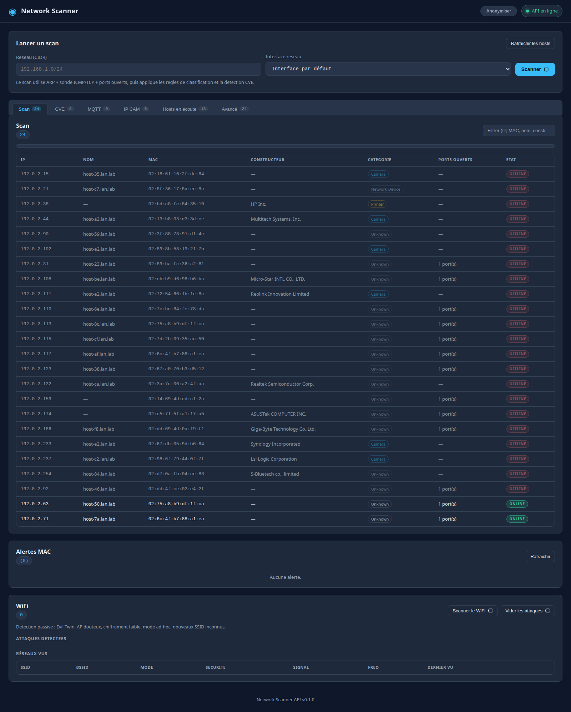
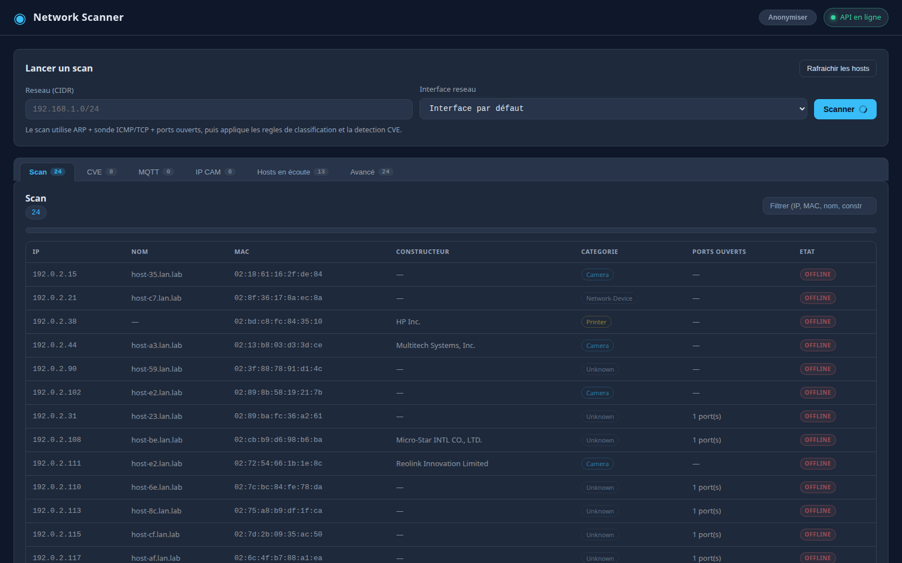
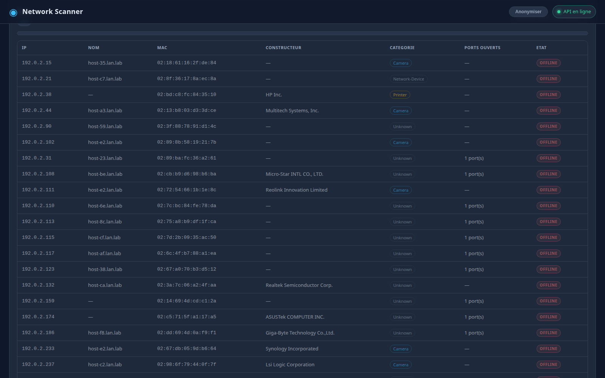
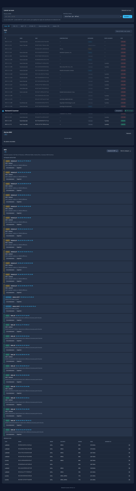
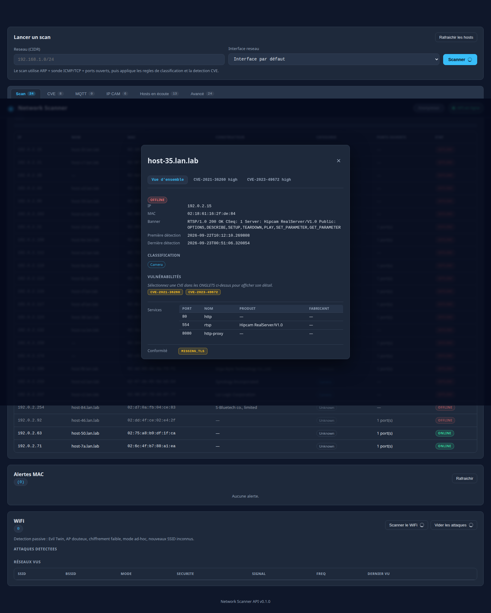

# Network Scanner

Plateforme de supervision réseau : scan actif (ARP/ICMP/TCP), fingerprint OS, classification d'équipements par règles YAML, détection d'attaques WiFi (evil twin, rogue AP, cryptage faible), détection de sniffing, suivi CVE d'exposition des services, API REST complète et interface web en temps réel.

## Aperçu

| Vue d'ensemble | Console de scan |
|:-:|:-:|
|  |  |

| Résultats & alertes | Détection WiFi |
|:-:|:-:|
|  |  |

| Modal hôte | Détail CVE |
|:-:|:-:|
|  |  |

## Fonctionnalités

- **Scan réseau actif** — ARP + ICMP + TCP probes, fingerprint OS, classification par vendor (OUI) et règles YAML
- **Scan IP unique** — ciblage d'un hôte précis avec détection de services et CVE
- **Détection WiFi passive** — 5 types d'attaques :
  | Type | Severité | Description |
  |------|---------|-------------|
  | `EVIL_TWIN` | critique | SSID identique au réseau légitime, BSSID différent |
  | `ROGUE_AP` | haute | Point d'accès inconnu signalé anormalement fort |
  | `WEAK_CRYPT` | critique / haute / moyenne | WEP (critique), TKIP (haute), WPA/WPA2 ouvert (moyenne) |
  | `AD_HOC` | moyenne | Réseau en mode ad-hoc |
  | `NEW_AP` | basse | Nouvel AP inconnu détecté |
- **Détection de sniffing** — identification des MAC en écoute passive sur le segment local
- **Suivi CVE** — détection des vulnérabilités connues sur les services détectés (Nmap service/version), modal interactif
- **Surveillance passive continue** — mode monitor, alerts en temps réel
- **API REST** — endpoints pour scan, hôtes, alertes, WiFi, monitor, CVE
- **Interface web** — dashboard temps réel, modaux détaillés, badges CVE
- **Classification par règles YAML** — extension sans redémarrage

## Stack

| Couche | Technologies |
|--------|-------------|
| Backend | FastAPI, Pydantic v2, pydantic-settings |
| Scan | Scapy (ARP/ICMP/TCP), `manuf` (OUI) |
| WiFi | `nmcli` (détection passive) |
| DB | SQLAlchemy — SQLite (dev), PostgreSQL (prod) |
| Frontend | Vanilla JS, CSS (dark theme) |
| Tests | pytest (Scapy entièrement mocké) |

## Architecture

```
network_scanner/
├── scanner/            # Moteur de scan
│   ├── core.py         #     scan_network, scan_ip, os_fingerprint
│   ├── passive.py      #     surveillance passive
│   ├── sniffing.py     #     détection de sniffers (detect_sniffers, get_own_mac)
│   └── wifi_detect.py  #     détection d'attaques WiFi (5 règles)
├── classifier/         # Classification & enrichissement
│   ├── rules.py        #     Modèles Rule / ClassifyResult
│   ├── engine.py       #     ClassificationEngine, create_engine_from_yaml
│   ├── cves.py         #     detect_cves, get_cve_details
│   ├── compliance.py   #     conformité
│   └── credentials.py  #     gestion credentials
├── db/                 # Persistance SQLAlchemy
│   ├── models.py       #     Host, Alert, EventLog, ScanSession, WifiNetwork, WifiAttack, HostMAC, Service
│   └── init.py         #     initialisation de la DB et du schéma
├── api/                # Serveur FastAPI
│   ├── main.py         #     App + CORS + /status
│   ├── routes.py       #     Tous les endpoints
│   ├── models.py       #     Schémas Pydantic
│   └── config.py       #     Settings (pydantic-settings)
├── config/             # Configuration
│   ├── rules.yaml      #     Règles de classification
│   └── config.yaml     #     Paramètres scanner / DB / notifications
├── web/                # Frontend
│   ├── index.html      #     HTML
│   ├── app.js          #     Logique JS
│   └── style.css       #     CSS dark theme
├── utils/              # Utilitaires
│   ├── datetime_utils.py
│   └── logging.py
└── tests/              # Suite pytest
    ├── test_scanner.py
    ├── test_classifier.py
    ├── test_new_features.py
    └── test_wifi_detect.py
```

## Démarrage rapide

```bash
# 1. Cloner le dépôt
git clone https://github.com/zabuzafr/network_scanner.git
cd network_scanner

# 2. Créer l'environnement virtualisé
python -m venv venv
source venv/bin/activate

# 3. Installer les dépendances
pip install fastapi "uvicorn[standard]" sqlalchemy scapy manuf pyyaml "pydantic-settings"

# 4. Copier la configuration d'exemple
cp config/config.yaml.example config/config.yaml

# 5. Lancer l'API
uvicorn api.main:app --reload --port 8000
```

- Interface web : `http://localhost:8000`
- Swagger : `http://localhost:8000/docs`
- Health check : `curl http://localhost:8000/status`

> Le scan actif utilise Scapy et nécessite les droits `CAP_NET_RAW` (ou `sudo`).

## API Endpoints

| Méthode | Route | Description |
|---------|-------|-------------|
| `GET` | `/status` | Health check |
| `POST` | `/scan` | Déclencher un scan CIDR (CIDR, iface, timeout) |
| `GET` | `/scan/{scan_id}` | Statut d'un scan en cours |
| `POST` | `/scan/ip` | Scan d'une IP unique |
| `GET` | `/hosts` | Liste des hôtes persistés |
| `GET` | `/alerts` | Alerte de sécurité |
| `GET` | `/cves` | Liste des CVE connues |
| `GET` | `/cves/{cve_id}` | Détail d'une CVE |
| `GET` | `/interfaces` | Interfaces réseau disponibles |
| `POST` | `/monitor/start` | Démarrer la surveillance passive |
| `POST` | `/monitor/stop` | Arrêter la surveillance |
| `GET` | `/monitor/status` | Statut du monitor |
| `GET` | `/wifi/interface` | Info interface WiFi |
| `GET` | `/wifi/scan` | Scan WiFi passif |
| `GET` | `/wifi/attacks` | Historique des attaques détectées |
| `POST` | `/wifi/networks/{bssid}/acknowledge` | Marquer un AP comme connu |
| `DELETE` | `/wifi/attacks/{attack_id}` | Supprimer une alerte |
| `DELETE` | `/wifi/attacks` | Vider l'historique |

## Configuration

Via `config/config.yaml` ou variables d'environnement (pydantic-settings) :

| Clé / Variable | Défaut | Description |
|----------------|--------|-------------|
| `scanner.default_cidr` | `10.0.0.0/24` | Bloc CIDR par défaut |
| `scanner.timeout` | `2` | Timeout scan global (s) |
| `scanner.icmp_timeout` | `1.0` | Timeout probe ICMP (s) |
| `scanner.tcp_timeout` | `1.0` | Timeout probe TCP (s) |
| `scanner.tcp_probes` | `443,80` | Ports TCP sondés |
| `classifier.rules_yaml` | `config/rules.yaml` | Fichier de règles |
| `database.url` | `sqlite:///./network_scanner.db` | DSN SQLAlchemy |
| `notifications.telegram.enabled` | `false` | Notifications Telegram |
| `notifications.discord.enabled` | `false` | Notifications Discord |

## Règles de classification (`config/rules.yaml`)

Chaque règle définance un type d'appareil avec des critères de correspondance (`port`, `hostname_regex`, `vendor_regex`, `banner_regex`) et une priorité. Les hôtes sont classifiés pour chaque règle correspondante.

```yaml
rules:
  - name: "camera-onvif"
    category: "camera"
    matches:
      - port: 8899
    priority: 10
```

L'API rechargue le YAML à chaque scan — aucune nécessité de redémarrage.

## Tests

```bash
python -m pytest tests/ -v

# Un seul fichier
python -m pytest tests/test_wifi_detect.py -v

# Filtre par nom
python -m pytest -k "tcp" -v

# Avec couverture
python -m pytest tests/ --cov=scanner --cov=classifier --cov-report=term-missing
```

Les tests Scapy sont complètement mockés (`scanner.core.sr` / `sr1`) — aucun accès root ni réseau requis.

**Suite complète : 115 tests, toutes passes.**

## Licences

Ce projet est fourni « en l'état ». Les dépendances (Scapy, FastAPI, SQLAlchemy, etc.) sont sous leurs licences respectives.
